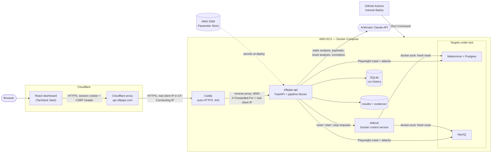
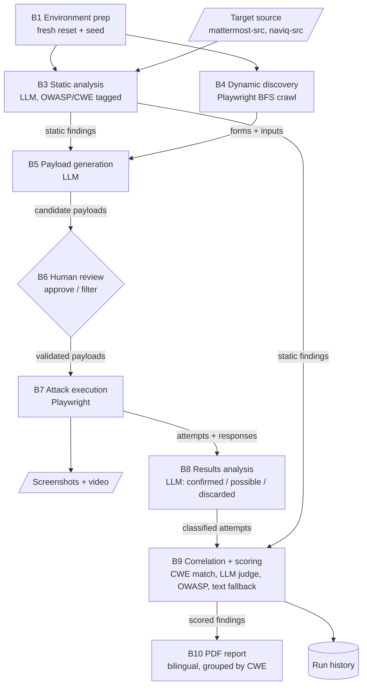

<div align="center">
An LLM-driven pipeline for automated web application security assessment.
</div>

<div align="center">
Visit: https://siftpipe.com
</div>

---

## Pipeline main blocks

| Block | Purpose
|---|---|
| `Environment prep`   | Docker fresh reset (Mattermost) or dev-server bring-up (NaViQ), per-target seeding
| `Static Analysis`   | LLM-based source review per target, OWASP/CWE tagging
| `Dynamic Discovery`   | Playwright same-origin BFS crawl, form/input extraction
| `Payload Generation`  | LLM-generated attack payloads from the static analysis + the dynamic discovery output
| `Human Review`   | Validates/filters payloads before the next block runs them
| `Attack Execution `   | Runs validated payloads against real forms, captures responses/screenshots/video
| `Results Analysis`   | LLM classifies each attack attempt as confirmed/possible/discarded
| `Correlation`   | Matches dynamic findings back to static ones (CWE-exact → LLM judge → OWASP → text fallback), scores severity
| `Reporting`   | Bilingual PDF export per run, grouped remediation by CWE
| `UI`   | React dashboard for the full pipeline, human review, and past-run history

---

## Architecture

**Runtime topology** — how the deployed system fits together:



**Pipeline data flow** — what each block reads and produces:



Every block is exposed through `api.py` (`/api/run`, `/api/results/{block}`, …) and can also be run from the console via `main.py`. Per-target configuration (selectors, credentials, scan scope) lives in `blocks/targets.py`.

---

## Stack

- **Backend:** Python, FastAPI, Anthropic Claude (`claude-haiku-4-5`), Playwright, SQLite (run history)
- **Frontend:** React 19, TanStack Start/Router, TypeScript, Tailwind, Radix UI
- **Infrastructure:** Docker Compose (`siftpipe-api`, `sidecar`, `naviq`, `mattermost`, `postgres`, `caddy`), Caddy (automatic HTTPS), AWS EC2 + SSM Parameter Store for secrets, Cloudflare (frontend hosting)
- **Testing:** 460+ backend tests (`unittest`), 210+ frontend tests (Vitest)
- **CI/Security:** GitHub Actions (lint/test/format check, dependency audit, Docker smoke test, manual SSM deploy with an active-run guard), CodeQL, Dependabot, secret scanning + push protection

---

## Project Structure

```
SiftPipe/
├── main.py                     # Console entrypoint — runs the pipeline B1→B9 by target/mode
├── api.py                      # FastAPI app — every block exposed as an endpoint, session-cookie auth
├── seed.py                     # Seeds a fresh Mattermost instance with test data
├── deploy.sh                   # Wrapper around the multi-file `docker compose` stack (up/down/config/ps/exec/logs/reset)
├── docker-compose.yml          # siftpipe-api, sidecar, naviq, init-permissions, caddy (Mattermost/Postgres come from mattermost/)
│
├── blocks/                     # Pipeline logic — see detail below
│
├── ui/                         # React/TanStack Start frontend
│   └── src/
│       ├── components/
│       │   ├── secpipeline/    # Pipeline views: Sidebar, CorrelationView, PastRunsView, etc.
│       │   ├── auth/           # Login page, session guard
│       │   └── ui/             # Shared UI primitives (shadcn/Radix-based)
│       ├── lib/                # API client, React Query hooks
│       └── routes/             # TanStack Router routes
│
├── tests/                      # Backend test suite, one file per block/module
├── sidecar/                    # Small control service that runs Docker operations (resets) on behalf of siftpipe-api
├── docker/                     # Dockerfiles/entrypoints per service (siftpipe-api, sidecar, naviq, caddy)
├── scripts/                    # Deploy helpers: ssm-deploy.sh (used by the deploy workflow), fetch-mattermost-secrets.sh
├── test-fixtures/              # NaViQ stub used by CI's docker-smoke job in place of the real (private) NaViQ
├── .github/workflows/          # ci.yml (backend, frontend, docker-smoke), codeql.yml, deploy.yml (manual, OIDC → SSM)
│
├── mattermost/                 # Docker Compose stack for the Mattermost target
├── mattermost-src/             # Mattermost source (git submodule, scanned by B3)
├── naviq-src/                  # NaViQ source (private, gitignored — the second target)
│
├── results/                    # Per-run pipeline output (gitignored)
├── evidence/                   # B7 screenshots/videos (gitignored)
├── siftpipe_history.db         # SQLite run history
│
├── qa_reports/                 # Local and deployed QA pass reports
│
└── docs/                       # Project documentation — see below
```

---

## blocks/ — Detail

```
blocks/
├── pipeline.py           # Shared primitives: lazy Anthropic client, ask_llm(), run_static_analysis(),
│                          #   run_dynamic_discovery(), execute_attacks() (no import-time side effects)
├── bootstrap.py           # Explicit start-up: load_environment() (.env + SSM), configure_logging(),
│                          #   env-var validation - called by api.py and main.py, not on import
├── pipeline_state.py      # PipelineState: the run's lifecycle flags and their transitions
├── llm.py                # Shared Anthropic call shape (JSON verdict, fence-stripping) used by every
│                          #   LLM-calling block
├── targets.py             # TargetProfile — single source of truth per target (selectors,
│                          #   credentials, B3 scan config)
├── environment.py         # B1 — fresh_reset() (Mattermost/Docker) and naviq_fresh_reset() +
│                          #   dev-server lifecycle (NaViQ)
├── static_scanner.py      # B3 — file listing, extension/dir filtering, prompt construction; each finding
│                          #   also carries a short LLM-written explanation of why it was flagged
├── crawler.py             # B4 — generic same-origin BFS crawl for attack-surface discovery
├── dynamic_analysis.py    # B4 — orchestrates login, crawl, form/input extraction
├── mattermost_auth.py     # Shared login-selector resolution (with fallback), used by B4 and B7
├── generate_payloads.py   # B5 — LLM-generated payloads from B3 + B4 output
├── human_review.py        # B6 — console-mode payload validation (API-mode lives in api.py)
├── dynamic_injector.py    # B7 — executes validated payloads, detects anomalies, captures evidence
├── analyze_results.py     # B8 — LLM classification of each B7 attempt
├── correlate_results.py   # B9 — static/dynamic correlation engine (CWE match → LLM judge → OWASP
│                          #   → text fallback), reuses judgments across runs
├── scoring.py             # B9 — weighted confidence/severity scoring
├── taxonomy.py            # CWE/OWASP catalog + inference helpers, shared across B3/B5/B7/B9/B10
├── report.py              # B10 — bilingual PDF report generation (Playwright/Chromium), incl. per-finding
│                          #   "Why:" explanation
├── run_history.py         # SQLite persistence for "Past Runs"
├── auth.py                # Session-cookie login gate (single shared admin passphrase)
└── aws_secrets.py         # Backfills secrets from AWS SSM Parameter Store at deploy time
```

---

## Running it

**Local development** (Python + Vite dev server):

```bash
# Backend
python -m venv venv && venv\Scripts\activate      # or source venv/bin/activate
pip install -r requirements.txt -r requirements-dev.txt
git submodule update --init                        # pulls mattermost-src, scanned by B3
uvicorn api:app --reload --port 8000

# Frontend
cd ui
npm ci
npm run dev
```

**Containerized stack** (what production runs; needs Docker, a filled-in `.env` from `.env.example`, and `mattermost/.env` from `mattermost/.env.example`):

```bash
./deploy.sh up       # builds and starts every service
./deploy.sh down
```

**Deployment:** the backend runs on EC2 behind Caddy at `api.siftpipe.com`, with secrets in SSM Parameter Store. It is updated by the manual **Deploy** GitHub Action (`.github/workflows/deploy.yml` → `scripts/ssm-deploy.sh`), which refuses to deploy while a pipeline run is active unless forced. The frontend deploys separately through Cloudflare. Full setup steps are in `docs/deployment-guide.md`.

---

## Docs
See /docs for the compiled project write-up (`siftpipe-compiled.md`), fixes log, containerization/deployment guides, resource/cost plan and script reference. QA pass reports are in /qa_reports.


<div align="center">
Thanks!

    <div class="tenor-gif-embed" data-postid="2505349896284898976" data-share-method="host" data-aspect-ratio="1" data-width="100%"><a href="https://tenor.com/view/cat-computer-windows-xp-distracted-gif-2505349896284898976">Cat Computer GIF</a>from <a href="https://tenor.com/search/cat-gifs">Cat GIFs</a></div>
</div>
